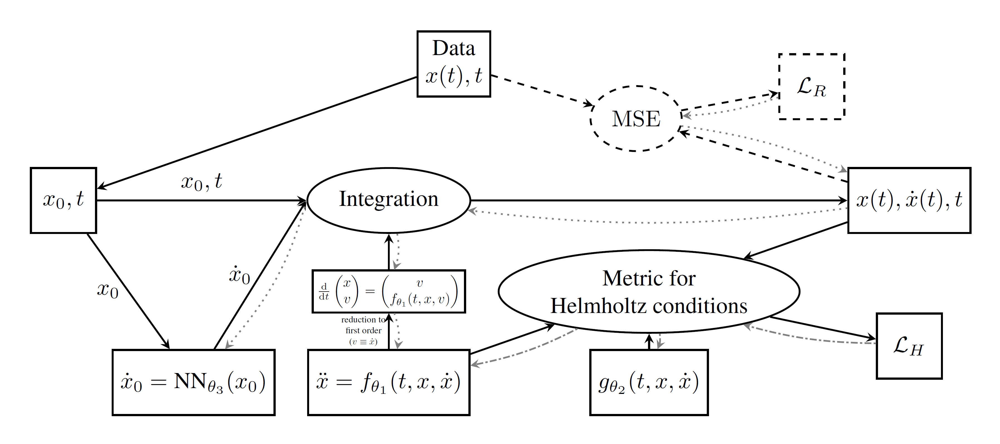

# Core lanede framework

Lagrangian neural ODEs can be trained on positional data to learn the underlying dynamics of a system, as represented by an Euler-Lagrange equation, a second order ODE. Once trained, they are able to predict the trajectories (position and velocity), given the initial conditions and the time points to predict at. Given the position, velocity and the time points, the acceleration at these time points can be predicted as well. As the key novelty in this framework, Helmholtz metrics can be used to quantify how well the learned ODE resembles an Euler-Lagrange equation, which allows using them for regularization during training. Thus, a Lagrangian neural ODE (lanede) is able to report the accuracy of this resemblance given trajectories to evaluate on.

The flowchart below gives an overview of a Lagrangian neural ODE model for the special case, where only positional data is used, initial velocities are predicted from initial position and a certain Helmholtz metric is used.

All of these tasks are streamlined in the API class `lanede.api.LanedeAPI`, where every task can be performed by calling the corresponding method. The API is based on JSON-serializable configuration dictionaries, which allows their easy setup as well as saving and loaing models in a convenient way. For more details on the API, see the [API Quickstart](docs/api_quickstart.md).

## Lagrangian Neural ODEs

The restriction to configuation dictionaries in the API restricts flexibility and extensibility. For this reason, the lanede framework, in its core, is implemented in a modular way, where the different components of a model are implemented as separate classes. The top level class is `lanede.core.LagrangianNeuralODE`, which combines all the components and provides almost the same methods as the API, except for configuration dictionaries and explicit loading and saving functionalities. Instead, the neccessary subcomponents are passed as objects on initialization and, analogously to PyTorch, `state_dict` and `load_state_dict` methods are implemented to save and load the model's internal state. Like in PyTorch, saving or loading the full model, either requires pickling the whole object (where all details become unaccesible) or remembering the exact subcompontes with all their settings (like layer sizes) to reinitialize the model and then load the state dict.

As the top level class, the `LagrangianNeuralODE` still abstracts away all details involving training and inference to allow applying it on the desired data as easy as possible. For this reason, like for the API, data is passed as numpy arrays, not as PyTorch tensors. Basic data processing, such as normalisation, is also done automatically.

Like the API, it directly allows to access the models prediction accuracy used in training, given predicted and true trajectories.

For performing their task, the methods of the `LagrangianNeuralODE` use a `lanede.core.Normalizer` to normalise the data and a `lanede.core.LagrangianNeuralODEModel` to decide about the internals of the model. The latter is trained by calling `lanede.core.train_lagrangian_neural_ode`, a general training loop for Lagrangian neural ODE models.

The API then is simply a wrapper around `LagrangianNeuralODE` where certain decisions on its subcomponents are already made by a preset and can be refined by the configuration dictionary.

## Normalizer

Proper normalisation of data is crucial for training neural networks. Usually this is easy to do, where a normalizer object is fitted to the data (e.g., computing the mean and standard deviation) and then its normalisation and inverse normalisation transformations are applied to the data and the model's predictions, respectively. However, for the present application normalisation is more complex: Any transformation of, e.g., the position data or the time points also transforms the velocity and acceleration data and vice versa. Worse still, the velocity or acceleration might not be given in the data at all, which means that their prediction by integrating or evaluating the ODE yields normalised values, whose real-world equivalents are unknown. Most neural ODE implementations avoid this problem by simply not normalising the data, which only works for toy systems that are sufficiently simple and chosen to have a suitable scale. For any real-world application, however, this is likely not sufficient.

To this end, the `lanede.core.Normalizer` abstract class is implemented, that automatically handles normalisation and inverse normalisation of the data, including inferred velocity and acceleration transformations. Implementing a specific, custom normalisation scheme only requires subclassing the `Normalizer` and implementing fitting, as well as the transformation, its inverse and its derivative.

The class is designed to be similar to the normalizers in scikit-learn. The `fit` method is to be called first and only with the training data in the format it is supplied to the model. That is, if only position is supplied when training the model, one must fit the normalizer only on the position data, as the normalizer then internally decides how to transform the velocity and acceleration data.

For more information about normalisation in this context, in particular how the transformation of the velocity and acceleration data is inferred, see [Normalizer transforms](docs/transforms.md).

A Normalizer that normalizes the data supplied to mean zero and standard deviation one is implemented as `lanede.core.MeanStd`, a dummy normalizer that does not transform the data is implemented as `lanede.core.Identity`.

## LagrangianNeuralODEModel

The `lanede.core.LagrangianNeuralODEModel`'s are the heart of Lagrangian neural ODEs, as they bundle all machine learning components and functionality together. They decide how data is processed to predict, measure error (including the helmholtz metric) and update the model. For this reason, they possess an `update` method, which can be called with a batch of training data and will update the model (i.e., its parameters) accordingly. This is part of the class, as an update to a Lagrangian neural ODE can be performed in many different ways, e.g., by adding both losses to obtain a single loss, by alternating between the two losses, by conditionally applying one of the losses, or by using advanced multitask learning techniques.

`LagrangianNeuralODEModel`'s are both, PyTorch `nn.Module`'s and abstract classes that should be subclassed to provide specific implementations. The base class already take measures for methods like `error` and `helmholtzmetric` to run without gradients, such that no update is performed based on them. To keep updates within the `update` method, any implementation of any method (including `update`) should make sure the returned results are detached from the computational graph, such that no gradients are propagated through.

The implementation `SimultaneousLearnedMetricOnlyX` uses a Helmholtz metric that also requires training and is simultaneously updated by a linear combination of the prediction error and the Helmholtz metric. Velocities are expected to not be given in the data and the initial velocity is predicted from the initial position.

Some Helmholtz metrics require training themselves, to measure the Euler-Lagrange resemblance of an ODE. In order to obtain this metric for a given ODE, `DouglasOnFixedODE` trains a special type of such a metric, while keeping the ODE fixed.

## train_lagrangian_neural_ode

Since the details on learning from data is abstracted away in `LagrangianNeuralODEModel`, only a single, general training loop is implemented, `lanede.core.train_lagrangian_neural_ode`. Given a `LagrangianNeuralODEModel` it is trained on given data for given settings by repeatingly calling the model's `update` method. It keeps track of relevant metrics and returns them after training.

## HelmholtzMetric

The `lanede.core.HelmholtzMetric` is an abstract class for Helmholtz metrics and a PyTorch `nn.Module`. Given a second order ODE and time points to numerically evaluate it at, it returns an estimate for how well the ODE resembles an Euler-Lagrange equation. Optionally, it can additionally return multiple named submetrics or the metric value at each time point, which can be used for more detailed analysis.

The implementation `TryLearnDouglas` is based on the Helmhotz conditions (the conditions when an ODE is an Euler-Lagrange equation) derived by [Jesse Douglas in 1941](https://doi.org/10.1073/pnas.25.12.631). There, three conditions need to be satisfied, that require the existence of a certain matrix valued function $g(t,x,\dot{x})$ (mass matrix) to be satisfied. Here, a neural network is evaluated to predict $g$, i.e., $g=g_\theta$ and the metric is computed based on the network's estimate for $g$ and the ODE. Thus, the metric also requires training to find the best estimate for $g$. Since certain derivatives of ODE and $g$ are computed, the framework, in many places, uses `torch.no_grad` instead of `torch.inference_mode`. Since `torch.func`is used, the ODE should be side-effect free. 

With `DummyHelmholtzMetric`, a dummy metric is implemented that always returns zero, which can be substituted for any other metric to obtain a model without Helmholtz metric regularization, when e.g., enforcing the Euler-Lagrange characteristic by construction.

## SolvedSecondOrderNeuralODE

A PyTorch `nn.Module` called `lanede.core.SolvedSecondOrderNeuralODE` is implemented to provide all functionality a second order neural ODE should have in a useful way: It can predict the acceleration, i.e. evaluate the ODE directly, as well as give the trajectory, i.e. the position and velocity at given time points, by integrating the ODE. Besides solver options, it requires to be supplied a second order ODE in the form of a `lanede.core.SecondOrderNeuralODE`, that decides how the ODE is evaluated.

## SecondOrderNeuralODE

The `lanede.core.SecondOrderNeuralODE` is an abstract class and a PyTorch `nn.Module` that represents a second order (neural) ODE. Sublasses need to implement the ODE via its second order function $\ddot{x} = f(t,x,\dot{x})$. Given this, it automatically provides a first order representation of the ODE as `forward` method, which is used for ODE integration (and thus predicting trajectories).

The implementation `FreeSecondOrderNeuralODE` is the most general implementation, where the second order function is directly given by a neural network that takes time, position and velocity as input.

Enforcing the Euler-Lagrange characteristic by construction, that is an [LNN](https://arxiv.org/abs/2003.04630), can be done by predicting the Lagrangian with a neural network and then computing the explicit Euler-Lagrange equation to obtain the second order ODE. This is implemented as `EulerLagrangeNeuralODE`, which employs several measures for stabilization, such as adding a quadratic kinetic energy term, as discussed in [this paper](https://arxiv.org/abs/2601.12519) and [this paper](https://arxiv.org/abs/2106.00026).

## Neural networks

In the framework, neural networks can simply be implemented as PyTorch `nn.Module`'s, as long as they meet the requirements of the component they are used in.

A basic feedforward neural network is implemented as `lanede.core.NeuralNetwork`.

When predicting a Lagrangian and backpropagating through the Euler-Lagrange equation, the [original LNN paper](https://arxiv.org/abs/2003.04630) proposes a custom initialization scheme for corresponding the neural network. This is implemented in `lanede.core.LNNNeuralNetwork`.

## TemporalScheduler

For neural ODEs it is standard practice to roll out the time points during training, i.e., to start training on only the first few time points and then increase the number of time points used during training. This can be realized with an implementation of the abstract class `lanede.core.TemporalScheduler`, that yields the ratio of time points to be used at a given training step.

A sigmoid scheduler is implemented as `lanede.core.SigmoidTemporalScheduler`.